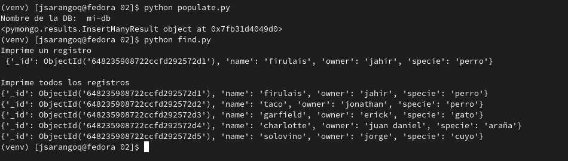

# Reto 02
Para poder ejecutar los scrips de python, primeramente procedemos a activar un entorno virtual
```
python -m venv venv
souce venv/bin/activate
```

Una vez activado nuestro entorno virtual, procedemos a instalar la librería pymongo
```
pip install pymongo
```
Ya con todos nuestro ambiente listo, procedemos a lavantar el contenedor de mongodb y posterior a esto ejecutamos los scrips python

```
docker run -d -p 27017:27017 --name m1 mongo
python populate.py
python find.py
```


