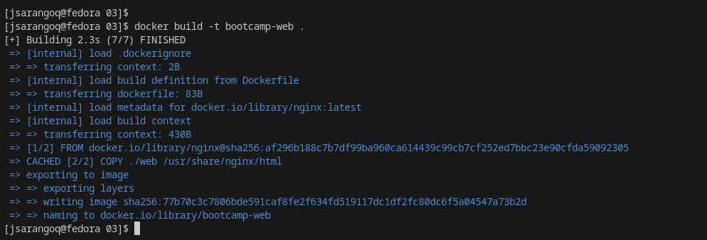
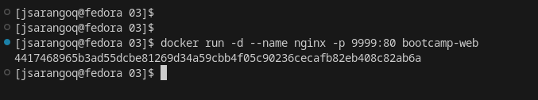
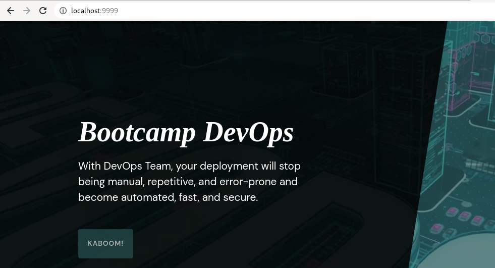
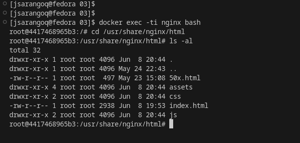

# Reto 03

Para crear el servidor, creamos un archivo Dockerfile, donde tomamos como imagen base nginx y copiamos todos los archivos y directorios del sitio web hacia el directorio ```/usr/share/nginx/html```

```
FROM nginx
COPY ./web /usr/share/nginx/html
```

Posterior a esto, creamos nuestra imagen con el nombre ```bootcamp-web```
```
docker build -t bootcamp-web .
```


Seguidamente, procedemos a crear el contenedor a p artir de la imagen creada en el paso anterior mapeando el puerto 9999 de mi máquina física hacia el puerto 80 del contenedor

```
docker run -d --name nginx -p 9999:80 bootcamp-web
```


Podemos acceder a través del navegador por el puerto 9999 ```http://localhost:9999/```



Dentro del contenedor, podemos listar los archivos que fueron copiados durante la Construcción de la imagen
