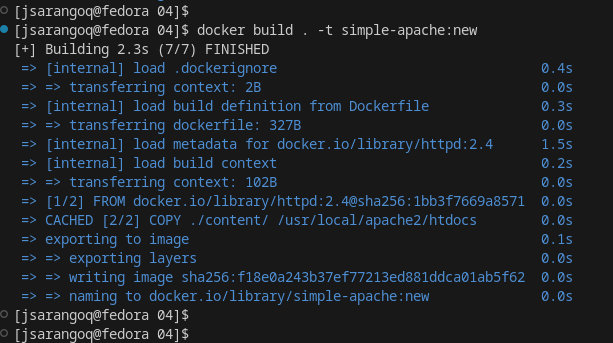
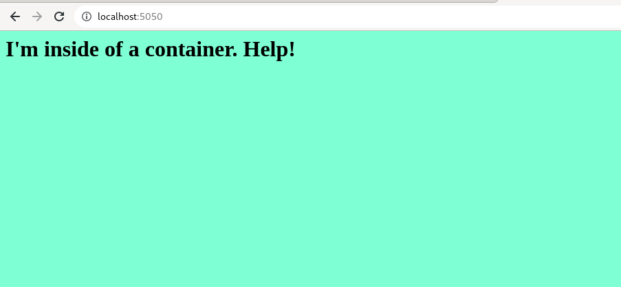
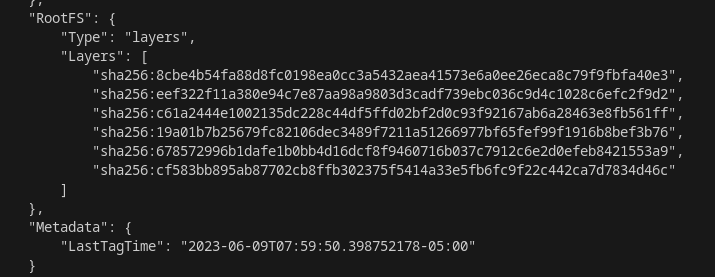
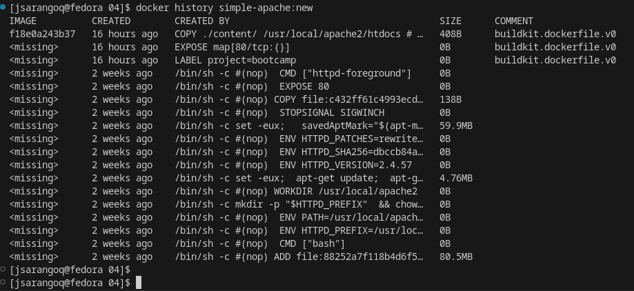
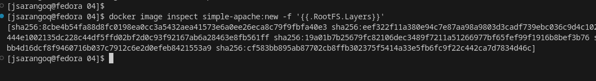

# Reto 04

Primeramente creamos el Dockerfile tomando como imagen base apache
```
FROM httpd:2.4

LABEL project="bootcamp"

EXPOSE 80

COPY ./content/ /usr/local/apache2/htdocs
```
Creamos la imagen con el nombre ```simple-apache:new```
```
docker build . -t simple-apache:new
```


Podemos ver el resultado al arrancar un contenedor en ```http://localhost:5050/```
```
docker run -d --name myapache -p 5050:80 simple-apache:new
```



## Inspeccionando la imagen

Ejecutamos el comandos ```docker inspect simple-apache:new```



De igual forma, ejecutamos el comando ```docker history simple-apache:new```



Podemos hacer un inspect de la imagen filtrando la sección que deseamos, en este caso vamos a filtrar la sección Layers ```docker image inspect simple-apache:new -f '{{.RootFS.Layers}}'```




