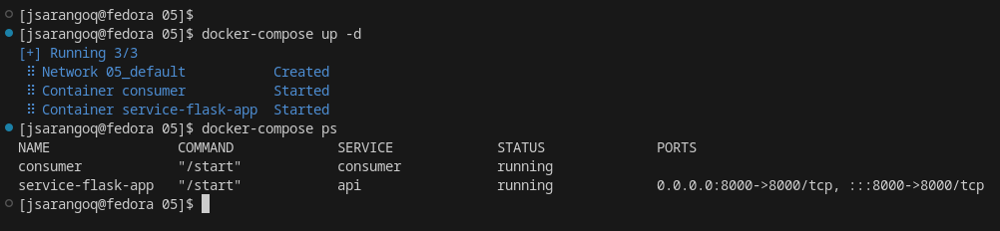

# Reto 05

## Creación de la imagen de la api flask
Para crear esta imagen se creó el siguiente Dockerfile
```
FROM python:3.10-alpine
RUN pip install flask
COPY ./src/* /app
COPY ./start /start

RUN sed -i 's/\r//' /start && \
    chmod +x /start

WORKDIR /app
```
El archivo start tiene ejecuta el script app.py
```
#!/bin/sh

set -o errexit
set -o pipefail
set -o nounset

python app.py
```

Con esto, se construye la imagen con los siguientes comandos y se sube a dockerhub
```
docker build -t jsarangoq/flask-api .
docker push jsarangoq/flask-api
```
## Creación de la imagen para el consumer
Se creó el siguiente Dockerfile
```
FROM python:3.10-alpine
ENV LOCAL true
ENV PYTHONUNBUFFERED 1

RUN pip install requests
COPY ./consumer/* /app/
COPY ./start /start

RUN sed -i 's/\r//' /start && \
    chmod +x /start
    
WORKDIR /app
```

El archivo start únicamente ejecuta el script consumer.py

```
#!/bin/sh

set -o errexit
set -o pipefail
set -o nounset

python consumer.py
```

De igual forma, con esto se construye la imagen y se publica en dockerhub
```
docker build -t jsarangoq/consumer .
docker push jsarangoq/consumer
```
Una vez construida las dos imágenes, se procede a construir nuestro archivo ```docker-compose.yml```
```
version: '3'

services:
  api:    
    image: jsarangoq/flask-api
    restart: always
    container_name: service-flask-app
    hostname: service-flask-app
    ports:
      - 8000:8000
    command: /start  

  consumer:    
    image: jsarangoq/consumer
    container_name: consumer
    hostname: consumer
    restart: always    
    command: /start  
```

Ejecutamos el comando ```docker-compose up -d``` y realizamos las comprobaciones respectivas.


Podemos ver la app corriendo en el puerto 8000


Si hacemos un ```curl http://localhost:8000``` de igual forma podemos ver el resultado esperado


Entramos al contenedor consumer ```docker exec -ti consumer sh``` y realizamos la ejecución del script ``` python consumer.py ```

Podemos ver el resultado de la ejecución


