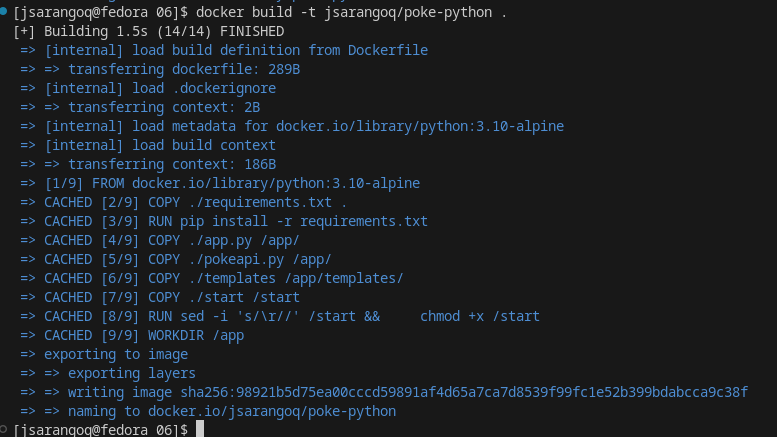
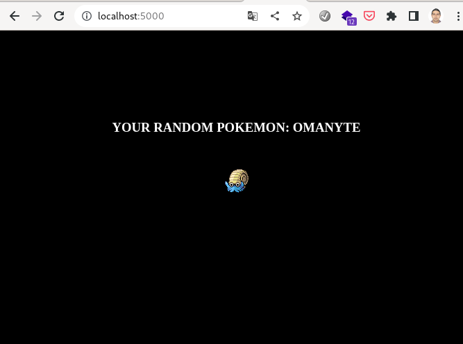

# Reto 06
Creamos el archivo Dockerfile
```
FROM python:3.10-alpine
COPY ./requirements.txt .
RUN pip install -r requirements.txt

COPY ./app.py /app/
COPY ./pokeapi.py /app/
COPY ./templates /app/templates/
COPY ./start /start

RUN sed -i 's/\r//' /start && \
    chmod +x /start

WORKDIR /app
```
El archivo start contiene lo siguiente
```
#!/bin/sh

set -o errexit
set -o pipefail
set -o nounset

python app.py
```

Construimos y publicamos la imagen
```
docker build -t jsarangoq/poke-python .
docker push jsarangoq/poke-python
```


Ejecutamos el docker-compose.yml

```
version: '3'

services:
  poke-api:    
    image: jsarangoq/poke-python
    restart: always
    container_name: poke-python
    hostname: poke-python
    ports:
      - 5000:5000
    command: /start  
```

Vemos los resultados

