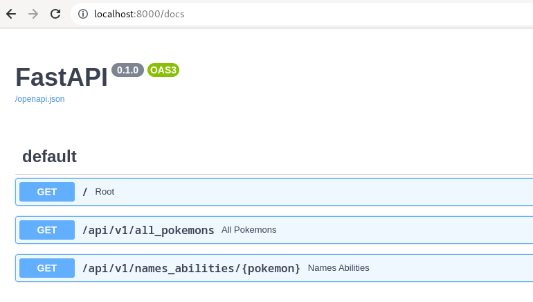
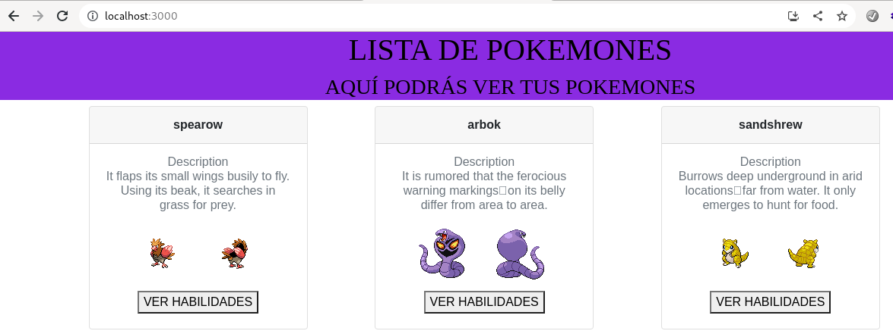

# Reto 07

## BackEnd

Creamos el siguiente Dockerfile
```
FROM python:3.10-alpine
COPY . /app/
WORKDIR /app
RUN pip install -r requirements.txt && \
    chmod +x entrypoint
ENTRYPOINT [ "./entrypoint" ]
```

El archivo ```entrypoint``` tiene el script para ejecutar el api
```
#!/bin/sh

python main.py
```

Construimos la imagen y la subimos a dockerhub
```
docker build -t jsarangoq/backend_pokemon:1.0.0 .
docker push jsarangoq/backend_pokemon:1.0.0
```
## FrontEnd
Construimos el siguiente Dockerfile
```
FROM node
ENV NODE_OPTIONS --openssl-legacy-provider
COPY . .
RUN yarn install
RUN chmod +x ./entrypoint

ENTRYPOINT [ "./entrypoint" ]    
```
El archivo entrypoint tiene las siguientes sentencias
```
#!/bin/sh

yarn run start
```

Construimos la imagen y la subimos a dockerhub
```
docker build -t jsarangoq/frontend_pokemon:1.0.0 .
docker push jsarangoq/frontend_pokemon:1.0.0
```

Una vez que disponemos de nuestras dos imágenes listas, procedemos a construir nuestro archivo ```docker-file.yml```
```
version: '3'

services:
  backend_pokemon:    
    image: jsarangoq/backend_pokemon:1.0.0
    restart: always
    container_name: backend_pokemon
    hostname: backend_pokemon
    ports:
      - 8000:8000

  front_pokemon:    
    image: jsarangoq/frontend_pokemon:1.0.0
    restart: always
    container_name: frontend_pokemon
    hostname: frontend_pokemon
    ports:
      - 3000:3000
```
Luego de ejecutar, podemos ver los resultados del backend:


Y el front en acción


