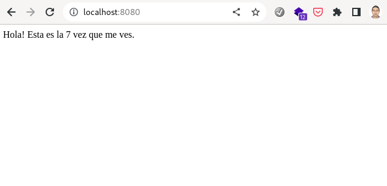

# Ret0 08
Creamos un Dockerfile para que ejecute nuestra aplicación, en ella instalamos flask y redis
```
FROM python:3.10-alpine
COPY ./app.py .
COPY ./entrypoint .
RUN pip install flask redis
RUN chmod +x ./entrypoint
ENTRYPOINT [ "./entrypoint" ]
```
El archivo entrypoint únicamente ejecuta el script app.python
```
#!/bin/sh

python app.py
```

Seguidamente creamos nuestro archivo docker-compose.yml
```
version: '3'

services:
  app:    
    image: flask-redis
    restart: always
    container_name: flask-redis
    hostname: flask-redis
    ports:
      - 8080:80

  redis:    
    image: redis
    restart: always
    container_name: redis
    hostname: redis
    ports:
      - 6379:6379

```

Levantamos los contenedores con el comando ```docker-compose up -d```

