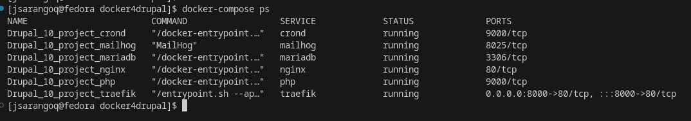
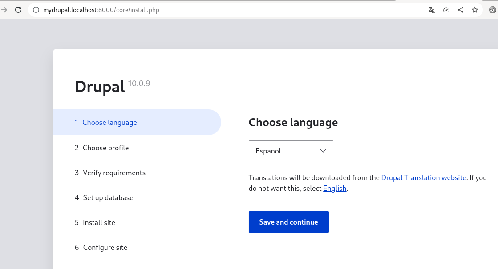

# Reto 09
Luego de realizar el clone ```git clone https://github.com/wodby/docker4drupal.git```, se realizaron las siguientes actividades:
- Modificación de variables de entorno. En el archivo .env podemos modificar las variables a nuestro criterio. En este caso únicamente se cambió el nombre del proyecto y la url que usará Traefik para servir la aplicación.
    ```
    PROJECT_NAME=Drupal_10_project
    PROJECT_BASE_URL=mydrupal.localhost
    ```
- Se creó un volumen para que los datos de mysql persistan cuando los contenedores son dados de bajo. Estos volúmenes se los incluyó en el archivo docker-compose.yml 
  ```
  volumes:  
  mysql_data_volume:


  services:
  mariadb:
    image: wodby/mariadb:$MARIADB_TAG
    container_name: "${PROJECT_NAME}_mariadb"
    stop_grace_period: 30s
    environment:
      MYSQL_ROOT_PASSWORD: $DB_ROOT_PASSWORD
      MYSQL_DATABASE: $DB_NAME
      MYSQL_USER: $DB_USER
      MYSQL_PASSWORD: $DB_PASSWORD
    volumes:
      - mysql_data_volume:/var/lib/mysql # Use bind mount
  ```

Luego de realizado estas modificaciones, procedemos a levantar los contenedores.

```
docker-compose up -d
docker compose ps
```
Podemos ver el resultado de la ejecución correcta.



De igual forma podemos ver la ejecución de drupal en la ruta indicada en las variables de entorno ```http://mydrupal.localhost:8000```
