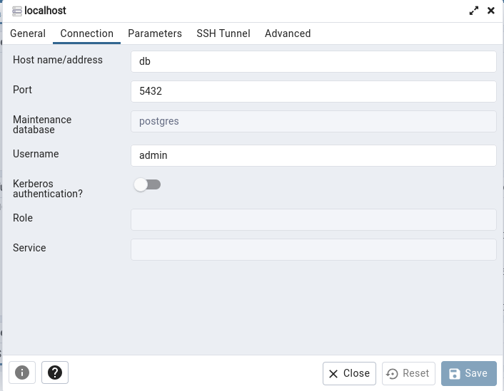
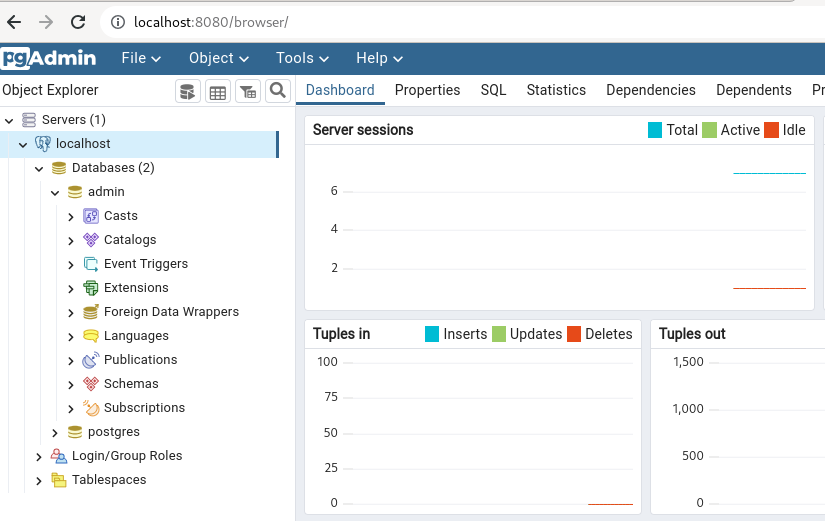

# Reto 10
Creamos el siguiente docker-compose.yml
```
version: '3'

services:
  db:
    image: postgres
    restart: always
    environment:
      POSTGRES_USER: admin
      POSTGRES_PASSWORD: example
    ports:
      - 5432:5432
    volumes:  
      - pg_data_volume:/var/lib/postgresql/data

  pgadmin:
    image: dpage/pgadmin4
    restart: always
    environment:
      PGADMIN_DEFAULT_EMAIL: admin@example.com
      PGADMIN_DEFAULT_PASSWORD: secret123
    ports:
      - 8080:80

volumes:  
  pg_data_volume:
```
Levantamos los contenedores con ```docker-compose up -d```



La conexión se establece correctamente.
