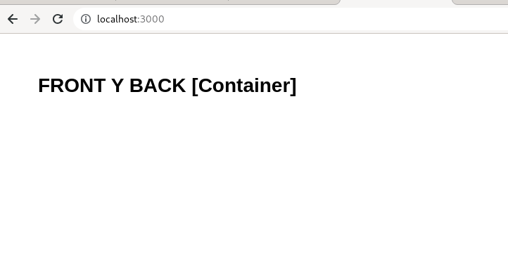
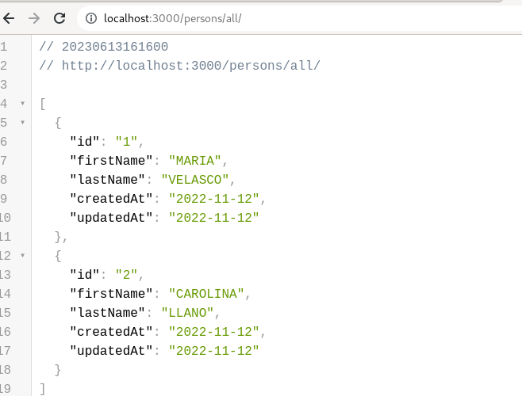
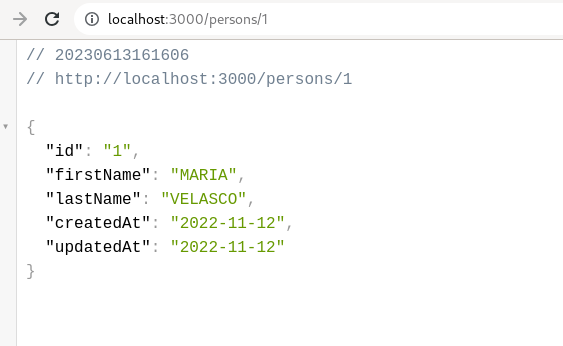
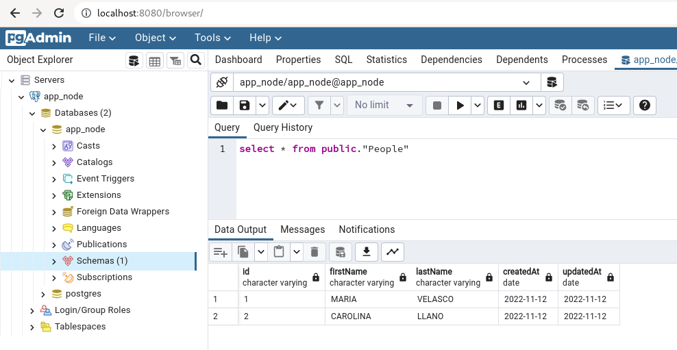

# Reto 14
Creamos el archivo Dockerfile
```
FROM node
ENV NODE_OPTIONS --openssl-legacy-provider
COPY src /src
COPY ./entrypoint /src
WORKDIR /src/
RUN chmod +x ./entrypoint
RUN yarn install

ENTRYPOINT [ "./entrypoint" ]    
```
El script de inicio y poblado de datos, lo montamos en un volumen local y lo enviamos al directorio ```/docker-entrypoint-initdb.d``` dentro del contenedor de postgres, que hará que se ejecute automáticamente el script. Este volumen está montado en el archivo ```docker-compose.yml```
```
version: '3'

services:
  app:
    image: app_node
    restart: always
    environment:
      DB_SCHEMA: app_node
      DB_USER: app_node
      DB_PASSWORD: app_node
      DB_HOST: postgres   
    ports:
      - 3000:3000  

  postgres:
    image: postgres
    restart: always
    environment:
      POSTGRES_DB: app_node
      POSTGRES_USER: app_node
      POSTGRES_PASSWORD: app_node
    ports:
      - 5432:5432
    volumes:  
      - pg_data_volume:/var/lib/postgresql/data
      - ./docker-entrypoint:/docker-entrypoint-initdb.d  

  pgadmin:
    image: dpage/pgadmin4
    restart: always
    environment:
      PGADMIN_DEFAULT_EMAIL: admin@example.com
      PGADMIN_DEFAULT_PASSWORD: secret123
    ports:
      - 8080:80

volumes:  
  pg_data_volume:
```
Levantamos todos los contenedores y probamos la correcta ejecución de la aplicación en la url ```http://localhost:3000/```

Llamada a la api que extrae todos los registros de la url ```http://localhost:3000/persons/all/```


De igual forma el llamado al endpoint que extrar los datos con el id ```http://localhost:3000/persons/1```


También podemos ver la conexión desde pgadmin ```http://localhost:8080/```
