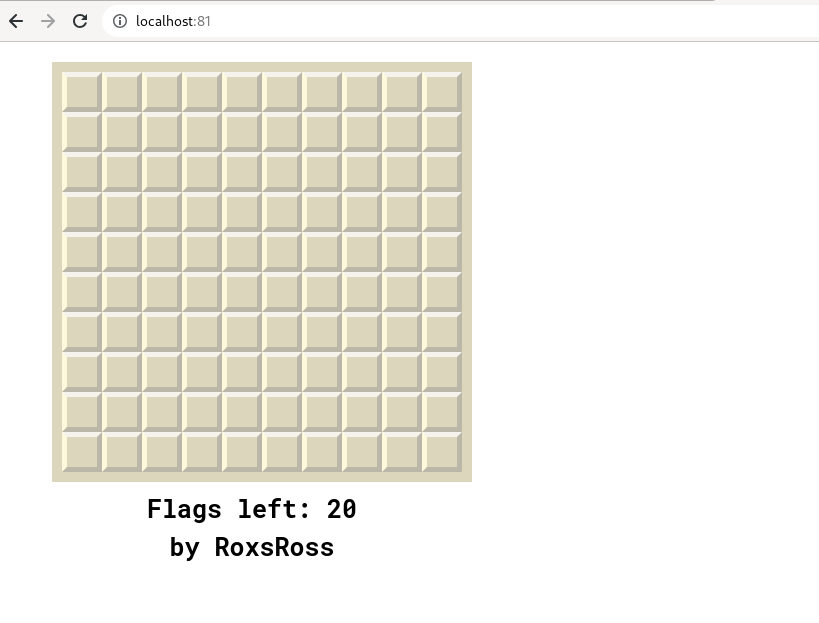

# Reto 15
Creamos el Dockerfile con una imagen de nginx
```
FROM nginx
COPY ./buscaminas /usr/share/nginx/html
```

Creamos nuestro archivo docker-compose.yml

```
version: '3'

services:
  buscaminas:
    image: buscaminas
    restart: always    
    ports:
      - 81:80
```

Probamos nuestro juego en la url ```http://localhost:81/```
